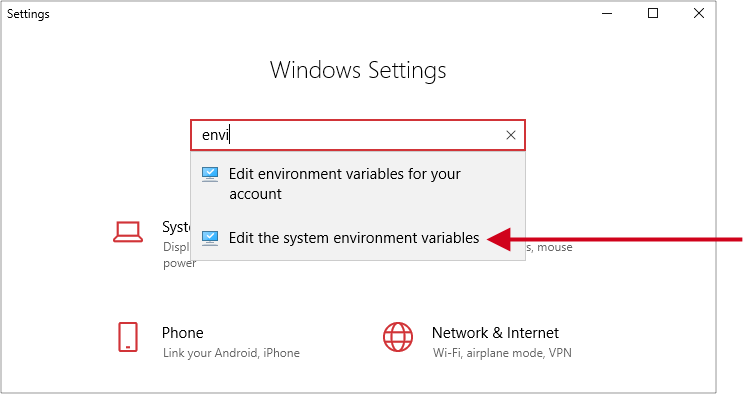
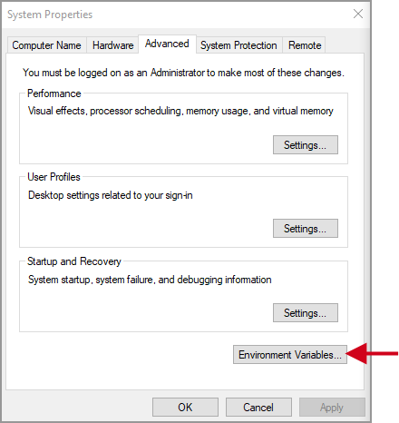
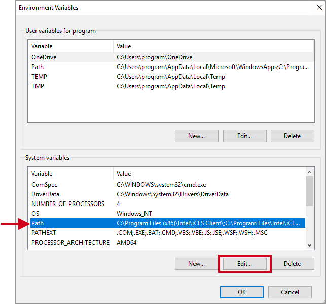

# Add Environment Variable Paths on a PC

Before programming ASR you must install [Python 2.7](https://www.python.org/downloads) and the driver for the [SEGGER J-Link](https://www.segger.com/downloads/jlink/#jlinksoftwareanddocumentationpack). Be sure to install to the default locations on your PC. In addition, before the provisioning script can run successfully you will need to add the paths to these executables to your environment variables. Note that these instructions are for Windows 10, but should be similar for other versions of Windows:

1. Click the Windows menu in the lower-left of your desktop, then click the Settings icon, highlighted in the illustration below:

   Windows Settings window opens, where you should start typing “envi”, as shown. Select “Edit the system environment variables” in the drop-down list, as indicated below by the red arrow; this will open the System Properties window.

2. On the System Properties window, click the ENVIRONMENTAL VARIABLES button:

3. On the Environment Variables window, select PATH to highlight it, then click the EDIT button:

4. The Edit Environment Variable window, opens. Click the NEW button on the right, then add the three entries for Python and J-Link, as shown below. Earlier versions of Windows (<10) may require that you add paths by separating them from existing paths with a semicolon (;).

   Be careful you **DO NOT** remove any existing paths when adding your new variable paths.   

5. Click OK on each of the open windows to save the new variable paths.

6. You’re all set!
