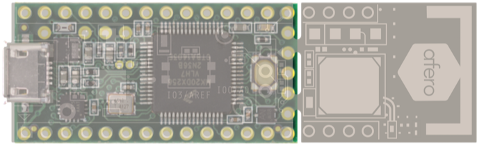
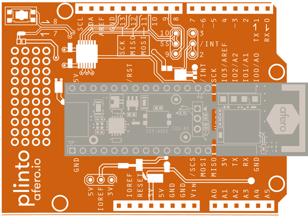
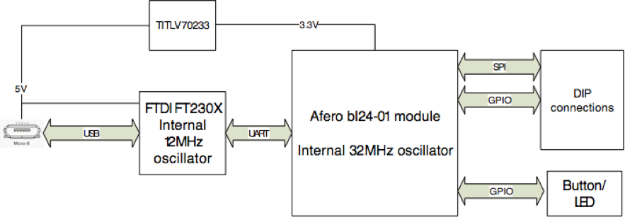
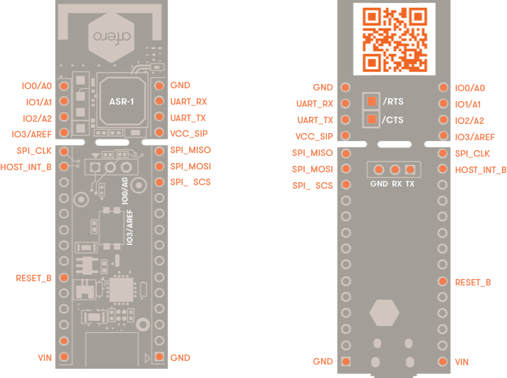
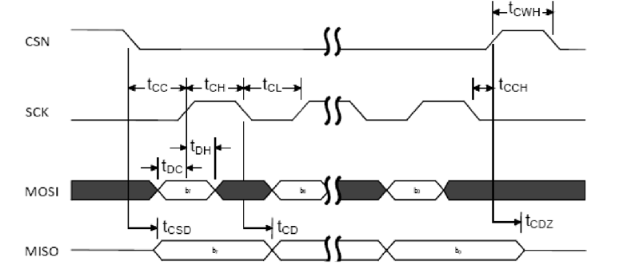

# Modulo-1 Data Sheet

Modulo-1 is the demonstration platform board for Afero Secure Radio. This page contains the following sections:

- [Connections](../Modulo1DataSheet#connections)
- [Specification](../Modulo1DataSheet#specification)
- [Block Diagram](../Modulo1DataSheet#block-diagram)
- [Pin Configuration](../Modulo1DataSheet#pin-configuration)
- [DC Electrical Specification](../Modulo1DataSheet#dc-electical-specification)
- [Environmental Specification](../Modulo1DataSheet#environmental-specification)

## Connections

The Modulo-1 is designed to attach directly to a Teensy (3.1 or better) board, or to a standard Arduino shield through the use of an Afero Plinto shield (sold separately at [Mouser](http://www.mouser.com/access/?pn=461AFERODB02&sn=afero&utm_source=afero&utm_medium=supplierwebsite&utm_campaign=ProductDetail&utm_content=plinto), PN 461-AFERO-DB-02).

*Click the images below to enlarge.*

### Modulo-1 Teensy Connections

#### Teensy Pins Used When Connected to Modulo-1

| PIN  | NAME  | DESCRIPTION                                                  |
| :--- | :---- | :----------------------------------------------------------- |
| 10   | CS    | Chip select for the Modulo-1 SPI bus.                        |
| 11   | MOSI  | Master out, slave in for SPI bus.                            |
| 12   | MISO  | Master in, slave out for SPI bus.                            |
| 13   | SCK   | Clock for SPI bus.                                           |
| 14   | INT   | Interrupt pin, Modulo-1 uses this to initiate communication. |
| 21   | RESET | Used to reboot the Modulo-1 when the Teensy boots.           |

### Modulo-1 Plinto Connections

#### Uno Pins Used When Connected to Modulo-1 via Plinto

| PIN   | NAME  | DESCRIPTION                                                  |
| :---- | :---- | :----------------------------------------------------------- |
| 2     | INT   | Interrupt pin. Modulo-1 uses this to initiate communication. |
| 10    | CS    | Chip select for the Modulo-1 SPI bus.                        |
| 11    | MOSI  | Master out, slave in for SPI bus.                            |
| 12    | MISO  | Master in, slave out for SPI bus.                            |
| 13    | SCK   | Clock for SPI bus.                                           |
| RESET | RESET | Used to reboot the Modulo-1 when the Uno boots.              |

## Specification

| Model name                    | Modulo-1                                        |
| ----------------------------- | ----------------------------------------------- |
| **Model number**              | AFERO-DB-01                                     |
| **Description**               | ASR-1 development board                         |
| **Bluetooth**                 | Bluetooth® low energy wireless technology (4.1) |
| **Bluetooth radio frequency** | 2.4 GHz                                         |
| **Ports**                     | Backup battery connection                       |
| **Buttons**                   | 1 GPIO input (configurable)                     |
| **LED indicators**            | 1 GPIO output (configurable)                    |
| **Security type**             | 256-bit ECC (Afero security)                    |
| **Dimensions**                | 5.969W x 1.778H x .4445D cm                     |
| **Unit weight**               | 5g                                              |
| **Power**                     | 5V, 100mA max                                   |
| **Certifications**            | FCC, IC                                         |
| **Operating temperature**     | 0 to 40°C                                       |
| **Storage temperature**       | -20 to 60°C                                     |
| **Operating humidity**        | 10 to 80% non-condensing                        |
| **Storage humidity**          | 5 to 90% non-condensing                         |

## Block Diagram

## Pin Configuration

### Pinout Diagram - Top and Bottom Views

### Pin Descriptions

| PIN NAME   | I/O           | DESCRIPTION                                            |
| :--------- | :------------ | :----------------------------------------------------- |
| GND        |               | Ground                                                 |
| VCC        | I/O           | Module power (3.3V)                                    |
| VIN        | I             | Power input from Teensy/Plinto (5V)                    |
| RESET_B    | I             | System reset (active low)                              |
| HOST_INT_B | O, open-drain | GPIO; host interrupt                                   |
| IO0/A0     | I/O           | GPIO; ADC input 4 (used for Modulo-1 LED)              |
| IO1/A1     | I/O           | GPIO; ADC input 2                                      |
| IO2/A2     | I/O           | GPIO; ADC input 3                                      |
| IO3/AREF   | I/O           | GPIO; ADC reference voltage (used for Modulo-1 button) |
| SPI_MISO   | O             | GPIO; SPI master input/slave output                    |
| SPI_SCS    | I             | GPIO; SPI slave select                                 |
| SPI_SCLK   | I             | GPIO; SPI clock                                        |
| SPI_MOSI   | I             | GPIO; SPI master output/slave input                    |
| UART_RX    | I             | MCU UART interface RX                                  |
| UART_TX    | O             | MCU UART interface TX                                  |

## DC Electrical Specification

### Typical Power Consumption

|                          | CURRENT | UNIT |
| :----------------------- | :------ | :--- |
| TX Active (peak current) | 15.5    | mA   |
| RX Active (peak current) | 14.5    | mA   |

### GPIO Specification

A total of four lines of programmable bidirectional I/O are provided.

#### Digital I/O Characteristics

| INPUT VOLTAGE LEVELS                             | MIN.        | TYP. | MAX.        | UNIT |
| :----------------------------------------------- | :---------- | :--- | :---------- | :--- |
| VIH input logic level high                       | 0.7 x VCC** | -    | VCC**       | V    |
| VIL input logic level low                        | VSS         | -    | 0.3 x VCC** | V    |
| VOH output logic level high (std. drive, 0.5 mA) | VCC**-0.3   | -    | VCC**       | V    |
| VOH output logic level high (high drive, 5 mA)*  | VCC**-0.3   | -    | VCC**       | V    |
| VOL output logic level low (std. drive, 0.5 mA)  | VSS**       | -    | 0.3         | V    |
| VOL output logic level low (high drive, 5 mA)    | VSS**       | -    | 0.3         | V    |
| RPU Pull-up resistance                           | 11          | 13   | 16          | kΩ   |
| RPD Pull-down resistance                         | 11          | 13   | 16          | kΩ   |

\* Maximum number of pins with 5mA high driver is 3.
** VCC is 3.3V; VSS is 0V.

### SPI Interface - Slave Specification

The SPI interface operates in slave mode, at up to 1MHz.

#### Slave Characteristics

| PARAMETERS | DESCRIPTION                            | MIN.  | TYP. | MAX. | UNIT |
| :--------- | :------------------------------------- | :---- | :--- | :--- | :--- |
| ISPIS125K  | Run current for SPI slave at 125 kbps* |       | 180  |      | μA   |
| ISPIS2M    | Run current for SPI slave at 2 Mbps*   |       | 183  |      | μA   |
| fSPIS      | Bit rates for SPIS                     | 0.125 |      | 1    | Mbps |

\* CSN asserted.

#### SPI Slave Timing Diagram, One Byte Transmission, SPI Mode 0

#### SPI Slave Timing Parameters

| PARAMETERS            | DESCRIPTION               | NOTE           | MIN.  | TYP. | MAX. | UNIT |
| :-------------------- | :------------------------ | :------------- | :---- | :--- | :--- | :--- |
| tDC                   | Data to SCK setup         |                | 10    |      |      | ns   |
| tDH                   | SCK to Data hold          |                | 10    |      |      | ns   |
| tCSD                  | CSN to Data valid         | Low power mode |       |      | 7100 | ns   |
| Constant latency mode |                           |                | 2100  | ns   |      |      |
| tCD                   | SCK to Data valid         | CLOAD = 10pF   |       |      | 97** | ns   |
| tCL                   | SCK Low time              |                | 40    |      |      | ns   |
| tCH                   | SCK High time             |                | 40    |      |      | ns   |
| tCC                   | CSN to SCK setup          | Low power mode | 7000  |      |      | ns   |
| Constant latency mode | 2000                      |                |       | ns   |      |      |
| tCCH                  | Last SCK edge to CSN Hold |                | 2000  |      |      | ns   |
| tCWH                  | CSN Inactive time         |                | 300   |      |      | ns   |
| tCDZ                  | CSN to Output High Z      |                |       |      | 40   | ns   |
| fSCK                  | SCK frequency             |                | 0.125 |      | 1    | MHz  |
| tR, tF                | SCK Rise and Fall time    |                |       |      | 100  | ns   |

** Increases/decreases with 1.2 ns/pF load.

### UART Interface

The UART interface offers fast, full-duplex, asynchronous serial communication support in hardware up to 115.2 kbps. Parity checking is supported. It is connected to an FTDI FT230X UART-to-USB conversion IC.

#### UART Interface Parameters

| PARAMETERS | DESCRIPTION               | MIN. | TYP. | MAX. | UNIT |
| :--------- | :------------------------ | :--- | :--- | :--- | :--- |
| IUART115k  | Run current at 115200 bps | -    | 220  | -    | μA   |
| IUART1k2   | Run current at 1200 bps   | -    | 210  | -    | μA   |
| fUART      | Baud rate for UART        | 1.2  | -    | 1000 | kbps |

#### Auxiliary ADC Characteristics

| PARAMETERS                               | DESCRIPTION                                                  | MIN. | TYP. | MAX. | UNIT   |
| :--------------------------------------- | :----------------------------------------------------------- | :--- | :--- | :--- | :----- |
| DNL10b                                   | Differential non-linearity (10-bit mode)                     |      | < 1  |      | LSB    |
| INL10b                                   | Integral non-linearity (10-bit mode)                         |      | 2    |      | LSB    |
| Vos                                      | Offset error                                                 | -2   |      | +2   | %      |
| EG*                                      | Gain error                                                   | -2   |      | +2   | %      |
| VREF_VBG                                 | Internal Band Gap reference voltage (VBG)                    |      | 1.2  |      | V      |
| VREF_VBG_ERR                             | Internal Band Gap reference voltage error                    | -1.5 |      | +1.5 | %      |
| VREF_VBG_DRIFT                           | Internal Band Gap reference voltage drift                    | -200 |      | +200 | ppm/°C |
| VREF_EXT                                 | External reference voltage (AREF0/1)                         | 0.83 | 1.2  | 1.3  | V      |
| VREF_VDD_LIM                             | Limited supply voltage range for ADC using VCC with prescaler as the reference. CONFIG.REFSEL = SupplyOneHalfPrescaling | 1.7  |      | 2.6  | V      |
| CONFIG.REFSEL = SupplyOneThirdPrescaling | 2.5                                                          |      | 3.6  | V    |        |
| tADC10b                                  | Time required to convert a single sample in 10-bit mode      |      | 68   |      | μs     |
| tADC9b                                   | Time required to convert a single sample in 9-bit mode       |      | 36   |      | μs     |
| tADC8b                                   | Time required to convert a single sample in 8-bit mode       |      | 20   |      | μs     |
| tADC                                     | Current drawn by ADC during conversion                       |      | 260  |      | μA     |
| ADC_ERR_1V8                              | Absolute error when used for battery measurement at 1.8 V, 2.2 V, 2.6 V, 3.0 V, and 3.4 V |      | 3    |      | LSB    |
| ADC_ERR_2V2                              |                                                              | 2    |      | LSB  |        |
| ADC_ERR_2V6                              |                                                              | 1    |      | LSB  |        |
| ADC_ERR_3V0                              |                                                              | 1    |      | LSB  |        |
| ADC_ERR_3V4                              |                                                              | 1    |      | LSB  |        |

\*  Source impedance less than 5 kΩ.
** Internal reference, input from VCC/3, 10-bit mode. VCC is 3.3V.

## Environmental Specification

### Absolute Maximum Rating

| DESCRIPTION           | MIN  | MAX     | UNIT |
| :-------------------- | :--- | :------ | :--- |
| Storage temperature   | -40  | 85      | °C   |
| Operating temperature | -20  | 75      | °C   |
| VCC                   | -0.3 | +3.9    | V    |
| VIO                   | -0.3 | VCC+0.3 | V    |

### Recommended Operating Condition

| PARAMETER                   | MIN  | MAX  | UNIT |
| :-------------------------- | :--- | :--- | :--- |
| Operating temperature range | -20  | 75   | °C   |
| VCC                         | 2.1  | 3.6  | V    |

 **&#8674;** *Next:* [Modulo-1B-TY Data Sheet](../Modulo1BTYDataSheet)