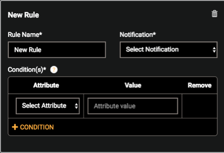
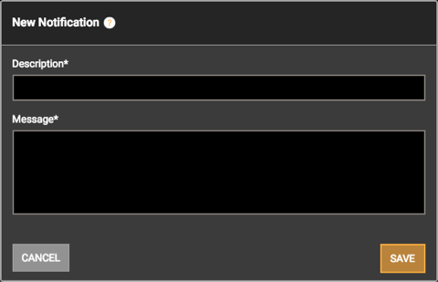
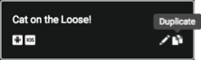
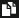

# Define the Rules & Notifications

Sometimes it may be useful to send the end-user a mobile app notification when their device reports a given state, such when batteries are low, a filter needs changing, or the wash is dry. Use this window to define the conditions (triggering events) and the resulting notification.

Defining rules and notifications is not mandatory, so you can skip this step if you wish.

## Create a Rule

A rule is defined by specifying at least one condition in which an attribute you’ve defined reports a certain value.

1. To get started, click

    

   RULES & NOTIFICATIONS

   . The Rules & Notification window opens:

   

   

2. Click +RULE. The rule definition editor opens:

3. Give your new rule a RULE NAME.

4. If you already have a notification defined that you can use for this rule, select it from the NOTIFICATION drop-down menu. If not, create a new notification:

5. 1. In the right-hand NOTIFICATIONS pane, select + NOTIFICATION. The New Notification window opens:
   2. Describe your notification briefly in the DESCRIPTION field. This description is what will appear in the drop-down menu in the rule definition editor and is only used internally (not exposed to end-users).
   3. In the MESSAGE field, type the message you want the end-user to receive on their smartphone. Messages are limited to 255 characters.
   4. Click SAVE when you’re done with the message. You can always edit or disable the message after you’ve saved it.
   5. If you have a notification you’ve already defined, you can use it as a template for a new one by selecting the duplicate icon:

6. Define the CONDITION(S), or triggering events, by selecting an ATTRIBUTE and the corresponding VALUE it must report to trigger the notification.

   If you list more than one condition, **all** conditions must be met before a notification is triggered.

   

7. To create another rule, simply click + RULE.

8. When you’re finished defining all your rules, click SAVE in the upper-right corner of the window.

## Manage Rules & Notifications

You can always modify your rules & notifications definition:

Edit a Rule - If your rule is collapsed, click the Rule Name to open its definition editor. Make your edits, then click the Rule Name to collapse it again.

Delete a Rule - Locate the rule you want to delete, then click the trash icon:. You’ll be asked to confirm.

Edit a Notification - Locate the notification you want to edit, then click the pencil icon . Make your edits, then click SAVE.

Duplicate a Notification - Locate the notification you want to duplicate and click the duplicate icon, located on the right. A new notification window opens using the Description and Message from the original notification. Make your edits, then click SAVE.

 Next: [Publish Your Profile](](.../Publish)