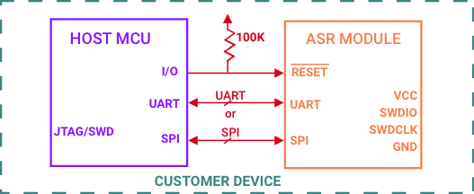

# afPro UART Protocol - A Practical Guide

This page describes a single path through the UART protocol, the minimum required for an MCU to communicate over UART. The full explanation is covered in [afPro UART Protocol - How It Works](../afPro-UART) and includes all the corner cases.

The high-level interactions between the MCU and ASR are outlined below in [Protocol Flow](../afPro-UART-S/#protocol-flow). The details of each interaction are described in the second section, [Procedure Descriptions](../afPro-UART-S/#protocol-procedures). The last section, [Attribute Data](../afPro-UART-S/#attribute-data), provides a handy worksheet for defining and mapping attributes to protocol messages, illustrated with our smart toaster oven data model from [Great Attribute Modeling](../AttrModel).

## Protocol Flow

The protocol flow consists of four high-level interactions (Boot Process, New Attribute Value to MCU, New Attribute Value to ASR), all described below.

### MCU: Boot Process

1. The MCU reboots ASR via Reset line. (Refer to diagram below.)
2. After ASR boots, ASR starts [Init Procedure](../afPro-UART-S/#init-procedure) with the MCU.
3. ASR starts [ASR to MCU Notify Procedure](../afPro-UART-S/#asr-to-mcu-notify-procedure) with the MCU.
4. Repeat Step 3 until Attribute ID 0xF5FD (ASR State) has Value=0x04 (Initialized).
5. After Step 4, the MCU can start sending attributes.

### ASR: Afero Platform Notifications to Send to MCU

ASR starts [ASR to MCU Notify Procedure](../afPro-UART-S/#asr-to-mcu-notify-procedure) with MCU.

### ASR: Product-Specific Commands to Send to MCU

ASR starts [ASR to MCU Command Procedure](../afPro-UART-S/#asr-to-mcu-command-procedure) with the MCU.

### MCU: Product-Specific Notifications to Send to ASR

The MCU starts [MCU to ASR Notify Procedure](../afPro-UART-S/#mcu-to-asr-notify-procedure) with ASR.

## Protocol Procedures

The following applies to the procedures detailed below:

- All values are in little endian.
- Checksum = Byte addition.
- If ASR does not reply to any message from the MCU within 10 seconds, the MCU will reset ASR using the Reset line.

### Init Procedure

This procedure is only performed during the boot process.

| ROW  | FROM ASR       | FROM MCU       | FUNCTION                 | DATA FORMAT | COMMENTS                                                     |
| :--- | :------------- | :------------- | :----------------------- | :---------- | :----------------------------------------------------------- |
| 1    | 0x32           |                | ASR Ready                |             | 0x32 only sent from ASR, not sent by the MCU. 0x32 sent every one second until MCU responds. |
| 2    |                | 0x300000000030 | Init Request             |             |                                                              |
| 3    | 0x300000000030 |                | Init Response            |             |                                                              |
| 4    | 0x32           |                | Init Response Terminator |             | 0x32 sent every one second until MCU responds.               |
| 5    |                | 0x310000000031 | Init Acknowledgement     |             |                                                              |
| 6    | 0x32           |                | Procedure Complete       |             | 0x32 sent every five seconds until MCU sends next message.   |

### ASR to MCU Notify Procedure

GG=0x0D & TTTT=0xF5FD; if TTTT!=0xF5FD, then discard

ASR notifies MCU of Afero System Attribute changes.

This example is designed to demonstrate basic principles while keeping things simple. The suggestion “if TTTT!=0xF5FD, then discard” is based on that idea of simplicity, but deserves some explanation, below.

The attribute ID 0xF5FD translates to 65013 decimal… which is ASR_SYSTEM_STATE. Even a simple application must watch for messages with this attribute ID, for a couple reasons:

- After a reboot, an MCU must wait for an ASR_SYSTEM_STATE message with value AF_MODULE_STATE_INITIALIZED before it is allowed to begin sending afLib commands.
- At any time, if the device receives an Over-The-Air application update, MCU will receive an ASR_SYSTEM_STATE with value AF_MODULE_STATE_UPDATE_READY when the update has been completely received. At that point, the MCU should trigger a reboot of ASR, to install the new software.

So, in the case of a very simple application (like this example), your code could choose to ignore ASR-to-MCU Notifications EXCEPT those where attribute ID is 65013. Those notifications must be handled, even by simple applications.

| ROW  | FROM ASR             | FROM MCU       | FUNCTION                 | DATA FORMAT                                                  | COMMENTS                                                     |
| :--- | :------------------- | :------------- | :----------------------- | :----------------------------------------------------------- | :----------------------------------------------------------- |
| 1    | 0x32                 |                | ASR Ready                |                                                              | ASR sends ASR Ready to MCU when ASR has bytes to send. 0x32 sent every one second until MCU responds. |
| 2    |                      | 0x300000000030 | Sync Request             |                                                              |                                                              |
| 3    | 0x300000YYYYZZ       |                | Sync Response            | •YYYY (# of bytes of data ASR will send) = LLLL + 2 (for value of LLLL, see row 7 below)  •ZZ = Checksum |                                                              |
| 4    | 0x32                 |                | Sync Response Terminator |                                                              | 0x32 sent every one second until MCU responds.               |
| 5    |                      | 0x310000YYYYZZ | Sync Acknowledgement     | •YYYY= YYYY from Sync Response (above)  •ZZ = Checksum        |                                                              |
| 6    | 0x32                 |                | Sync Complete            |                                                              |                                                              |
| 7    | LLLLGGRRTTTTSSUUNNNN |                | Update Attribute Header  | •LLLL = NNNN + 8  •GG = 0x0D  •RR = Ignore  •TTTT = Attribute ID (if !=0xF5FD, then discard)  •SS = 0x00  •UU = Ignore  •NNNN = Length of Attribute Data | See [Attribute Data](../afPro-UART-S/#attribute-data) below for details of "TTTT" and "NNNN". |
| 8    | V…                   |                | Set Attribute Data       | NNNN Bytes of Attribute Data                                 | See [Attribute Data](../afPro-UART-S/#attribute-data) below for details of "V…". |
| 9    | 0x32                 |                | Procedure Complete       |                                                              | 0x32 sent every five seconds until MCU sends next message.   |

### ASR to MCU Command Procedure

GG=0x0B

ASR sends command to MCU, MCU acknowledges that command was successful (SS=0x00), or failed (SS=0x05).

| ROW  | FROM ASR                     | FROM MCU             | FUNCTION                 | DATA FORMAT                                                  | COMMENTS                                                     |
| :--- | :--------------------------- | :------------------- | :----------------------- | :----------------------------------------------------------- | :----------------------------------------------------------- |
| 1    | 0x32                         |                      | ASR Ready                |                                                              | ASR sends ASR Ready to MCU when ASR has bytes to send. 0x32 sent every one second until MCU responds. |
| 2    |                              | 0x300000000030       | Sync Request             |                                                              |                                                              |
| 3    | 0x300000YYYYZZ               |                      | Sync Response            | •YYYY (# of bytes of data ASR will send) = LLLL + 2 (for value of LLLL, see row 7 below)  •ZZ = Checksum |                                                              |
| 4    | 0x32                         |                      | Sync Response Terminator |                                                              | 0x32 sent every one second until MCU responds.               |
| 5    |                              | 0x310000YYYYZZ       | Sync Acknowledgement     | •YYYY= YYYY from Sync Response (row 3 above)  •ZZ = Checksum  |                                                              |
| 6    | 0x32                         |                      | Sync Complete            |                                                              |                                                              |
| 7    | LLLLGGRRTTTTNNNN             |                      | Set Attribute Header     | •LLLL = NNNN + 6  •GG = 0x0B  •RR = Ignore  •TTTT = Attribute ID  •NNNN = Length of Attribute Data | Discard any message with GG!=0x0B. See [Attribute Data](../afPro-UART-S/#attribute-data) below for details of "TTTT" and "NNNN". |
| 8    | V…                           |                      | Set Attribute Data       | NNNN Bytes of Attribute Data                                 | See [Attribute Data](../afPro-UART-S/#attribute-data) below for details of "V…". |
| 9    | 0x32                         |                      | Procedure Complete       |                                                              | 0x32 sent every one second until MCU sends next message.     |
| 10   | *Wait until change is made…* |                      |                          |                                                              |                                                              |
| 11   |                              | 0x30XXXX0000ZZ       | Sync Request             | •XXXX (# of bytes of data MCU will send) = LLLL + 2 (for value of LLLL, see row 16 below)  •ZZ = Checksum | If MCU receives 0x32 after sending Sync Request, ignore the 0x32 and wait for Sync Response from ASR. |
| 12   | 0x30XXXXRRRRZZ               |                      | Sync Response            | •XXXX = XXXX from Sync Request (above)  •RRRR = Ignore  •ZZ = Checksum |                                                              |
| 13   | 0x32                         |                      | Sync Response Terminator |                                                              | 0x32 sent every one second until MCU responds.               |
| 14   |                              | 0x31XXXX0000ZZ       | Sync Acknowledgement     | •XXXX = XXXX from Sync Request (above)  •ZZ = Checksum        |                                                              |
| 15   | 0x32                         |                      | Sync Complete            |                                                              |                                                              |
| 16   |                              | LLLLGGQQTTTTSSUUNNNN | Update Attribute Header  | •LLLL = NNNN + 8  •GG = 0x0D  •QQ = RR (from row 7 above)  •TTTT = Attribute ID  •SS = 0x00 (success) or 0x05 (failure)  •UU = 0x02  •NNNN = Length of Attribute Data | See [Attribute Data](../afPro-UART-S/#attribute-data) below for details of "TTTT" and "NNNN". |
| 17   |                              | V…                   | Update Attribute Data    | NNNN bytes of Attribute Data                                 | See [Attribute Data](../afPro-UART-S/#attribute-data) below for details of "V…". |
| 18   | 0x32                         |                      | Procedure Complete       |                                                              | 0x32 sent every one second until MCU sends next message.     |

### MCU to ASR Notify Procedure

MCU notifies ASR of changes to MCU Attributes (device-side attributes).

| ROW  | FROM ASR       | FROM MCU             | FUNCTION                 | DATA FORMAT                                                  | COMMENTS                                                     |
| :--- | :------------- | :------------------- | :----------------------- | :----------------------------------------------------------- | :----------------------------------------------------------- |
| 1    |                | 0x30XXXX0000ZZ       | Sync Request             | •XXXX (# of bytes of data MCU will send) = LLLL + 2 (for value of LLLL, see row 6 below)  •ZZ = Checksum | If the MCU receives 0x32 after sending Sync Request, ignore the 0x32 and wait for Sync Response from ASR. |
| 2    | 0x30XXXXRRRRZZ |                      | Sync Response            | •XXXX = XXXX from Sync Request (row 1 above)  •RRRR = Ignore  •ZZ = Checksum |                                                              |
| 3    | 0x32           |                      | Sync Response Terminator |                                                              | 0x32 sent every one second until MCU responds.               |
| 4    |                | 0x31XXXX0000ZZ       | Sync Acknowledgement     | •XXXX = XXXX from Sync Request (above)  •ZZ = Checksum        |                                                              |
| 5    | 0x32           |                      | Sync Complete            |                                                              |                                                              |
| 6    |                | LLLLGGRRTTTTSSUUNNNN | Update Attribute Header  | •LLLL = NNNN + 8  •GG = 0x0D  •RR = 0x00  •TTTT = Attribute ID  •SS = 0x00  •UU = 0x01  •NNNN = Length of Attribute Data | See [Attribute Data](../afPro-UART-S/#attribute-data) below for details of "TTTT" and "NNNN". |
| 7    |                | V…                   | Update Attribute Data    | NNNN Bytes of Attribute Data                                 | See [Attribute Data](../afPro-UART-S/#attribute-data) below for details of "V…". |
| 8    | 0x32           |                      | Procedure Complete       |                                                              | 0x32 sent every one second until MCU sends next message.     |

## Attribute Data

Use the table format below to plan your attribute data and how it relates to afPro messages. The table below shows an example, using a smart toaster oven.

| ATTRIBUTE ID (TTTT) | DATA TYPE | LENGTH (NNNN) | ATTRIBUTE DATA (V…)                                          | ATTRIBUTE NAME         | ASR TO MCU BEHAVIOR                                          | MCU TO ASR BEHAVIOR                                          | COMMENTS                                                     |
| :------------------ | :-------- | :------------ | :----------------------------------------------------------- | :--------------------- | :----------------------------------------------------------- | :----------------------------------------------------------- | :----------------------------------------------------------- |
| **Example Data**    |           |               |                                                              |                        |                                                              |                                                              |                                                              |
| 0x0100              | Boolean   | 0x0100        | •0x00=Stop  •0x01=Start                                       | Start/Stop             | When ASR is set to:  •0x00, MCU stops running the selected mode.  •0x01, MCU starts running the selected mode. | •When running and end-user presses Start/Stop button, MCU sets to 0x00 and stops running.  •When not running and end-user presses Start/Stop button, MCU sets to 0x01. |                                                              |
| 0x0200              | SINT8     | 0x0100        | •0x01=Bake  •0x02=Convection  •0x03=Broil  •0x04=Toast  •0x05=Warm  •0x06=Reheat | Cooking Mode           | When ASR is set to:  •0x01, MCU sets to Bake mode.  •0x02, MCU sets to Convection mode.  •0x03, MCU sets to Broil mode.  •0x04, MCU sets to Toast mode.  •0x05, MCU sets to Warm mode.  •0x06, MCU sets to Reheat mode. | When end-user uses dial to select:  •Bake mode, MCU sets to 0x01.  •Convection mode, MCU sets to 0x02.  •Broil mode, MCU sets to 0x03.  •Toast mode, MCU sets to 0x04.  •Warm mode, MCU sets to 0x05.  •Reheat mode, MCU sets to 0x06. | Available when oven is *not running* (attr 1=0x00).          |
| 0x0300              | Boolean   | 0x0100        | •0x00=1-3 pieces  •0x01=4-6 pieces                            | Number of Toast Slices | When ASR is set to:  •0x00, MCU sets to toast 1-3 pieces of bread.  •0x01, MCU sets to toast 4-6 pieces of bread. | When end-user uses dial to set:  •1-3 pieces of toast, MCU sets to 0x00.  •4-6 pieces of toast, MCU sets to 0x01. | Available when oven is *not running* (attr 1=0x00).          |
| 0x0400              | SINT8     | 0x0100        | 0x01–0xA                                                     | Toast Shade            | When ASR is set to:  •0x01, MCU sets heat level to Defrost toast.  •0x02, MCU sets heat level to toast Very Light.  •0x03, MCU sets heat level to toast Light.  •0x04, MCU sets heat level to toast Between Medium and Light.  •0x05, MCU sets heat level to toast Medium.  •0x06, MCU sets heat level to toast Between Medium and Dark.  •0x07, MCU sets heat level to toast Dark.  •0x08, MCU sets heat level to toast Darker.  •0x09, MCU sets heat level to toast Darker yet.  •0x0A, MCU sets heat level to toast Very Dark. | When end-user uses slider to set:  •1-Defrost, MCU sets to 0x01.  •2, MCU sets to 0x02.  •3-Light, MCU sets to 0x03.  •4, MCU sets to 0x04.  •5-Medium, MCU sets to 0x05.  •6, MCU sets to 0x06.  •7-Dark, MCU sets to 0x07.  •8, MCU sets to 0x08.  •9, MCU sets to 0x09.  •10-Dark, MCU sets to 0x0A. | Available when cooking mode *Toast* is selected (attr 2=0x04). |
| 0x0500              | Boolean   | 0x0100        | • 0x00=Bagel  • 0x01=Bread                                    | Bagel                  | When ASR is set to:  •0x00, MCU sets heat to toast a bagel.     •0x01, MCU sets to toast bread. | "When end-user sets switch to set:  •Bagel, MCU sets to 0x00.  •Bread, MCU sets to 0x01. | Available when cooking mode *Toast* is selected (attr 2=0x04). |
| 0x0600              | Boolean   | 0x0100        | •0x00=C  •0x01=F                                              | Degree Units           | When ASR is set to:   •0x00, MCU sets degrees to read and display in Centigrade.  •lx01, MCU sets degrees to read and display in Fahrenheit. |   •When end-user sets switch to set:  •°C, MCU sets to 0x00.  •°F, MCU sets to 0x01. | Feature is always available.                                 |
| 0x0700              | SINT8     | 0x0100        | 0x64–0x1FA                                                   | Current Temp           | ASR displays current temperature in desired unit (°C or °F). | MCU sends ASR current temperature in desired unit (°C or °F). | Attribute is Read Only. Available when Cooking Mode *Bake*, *Convection*, or *Broil* is selected. |
| 0x0800              | SINT8     | 0x0100        | 0x64–0x1FA                                                   | Set Temp               | ASR sends MCU the desired temperature in specified unit (°C or °F). | MCU reports temperature updates as oven reaches desired set temp. | Available when Cooking Mode *Bake* or *Convection* is selected. |
| 0x0900              | SINT8     | 0x0100        | 0x00–0x03C                                                   | Timer                  | ASR sends MCU the set countdown time.                        | MCU decrements as timer counts down, sends updates to ASR.   | Available when Cooking Mode *Bake*, *Convection*, or *Broil* is selected. |
| 0x000A              | Boolean   | 0x0100        | •0x00=Silent  •0x01=Ring                                      | Timer Ring             | When ASR is set to:  •0x00, MCU turns timer ringer off.  •0x01, MCU turns timer ringer on. | When the timer has counted down, when set to:  •0x00, MCU does not ring.  •0x01, MCU rings. | Available when Cooking Mode *Bake*, *Convection*, or *Broil* is selected. |
| 0x0900-0xF4FD       |           | IGNORE        |                                                              |                        |                                                              |                                                              |                                                              |
| 0xF5FD              |           | 0x0100        | •0x00, 0x01, 0x02, 0x05=Ignore  •0x03=Update Ready to Apply  •0x04=Initialized |                        | •When ASR sets to 0x03, MCU toggles Reset line on ASR (reboot ASR).  •When ASR sets to 0x04, MCU sends all current attribute values to ASR using MCU to ASR Attribute Procedure (this happens after reboot). | N/A                                                          |                                                              |
| 0xF6FD-FFFF         |           | IGNORE        |                                                              |                        |                                                              |                                                              |                                                              |

 **&#8674;** *Next:* [Device Attribute Message Protocol](../AttrMsgProtocol)